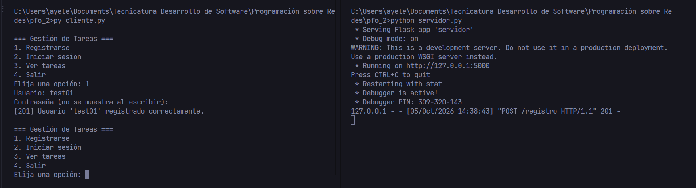
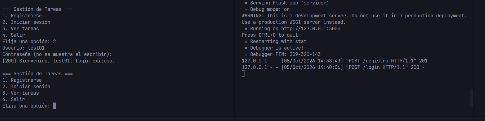
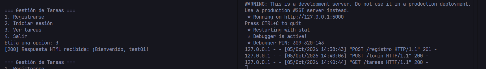
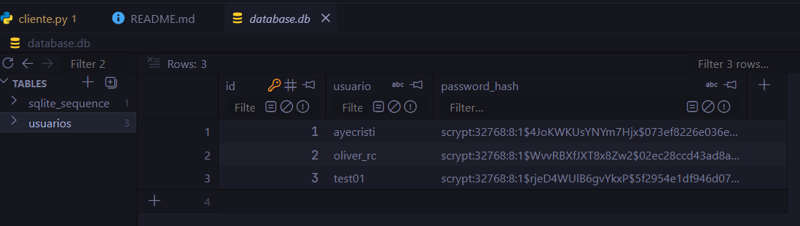

# PFO 2 – Sistema de Gestión de Tareas con API y Base de Datos

API REST en **Flask** con base de datos **SQLite**, contraseñas hasheadas con `werkzeug.security` y un cliente interactivo de consola basado en `requests`.

## Estructura

```
redes_pfo2/
├── servidor.py          # API Flask (registro, login, tareas)
├── cliente.py           # Cliente de consola
├── templates/
│   └── index.html       # Plantilla de bienvenida
├── capturas/            # Capturas de pantalla de las pruebas
├── requirements.txt
├── database.db          # Se genera automáticamente
└── README.md
```

## Instalación y ejecución

1. **Clonar el repositorio**
   ```bash
   git clone https://github.com/<tu-usuario>/redes_pfo2.git
   cd redes_pfo2
   ```
2. **Crear y activar un entorno virtual** *(opcional, recomendado)*
   ```bash
   python -m venv venv
   source venv/bin/activate      # Windows: venv\Scripts\activate
   ```
3. **Instalar dependencias**
   ```bash
   pip install -r requirements.txt
   ```
4. **Inicializar la base de datos** *(opcional)*: crea `database.db` y la tabla `usuarios`
   ```bash
   flask --app servidor init-db
   ```
   Si te salteás este paso, `python servidor.py` crea la base automáticamente al iniciar.
5. **Ejecutar el servidor**
   ```bash
   python servidor.py
   ```
   Queda escuchando en `http://127.0.0.1:5000`.
6. **Ejecutar el cliente** (en otra terminal, con el entorno activado)
   ```bash
   python cliente.py
   ```

## Guía de pruebas de los endpoints

### Con el cliente de consola
Opción 1 (registrarse) → 2 (iniciar sesión) → 3 (ver tareas).

### Con curl
```bash
# Registro
curl -X POST http://127.0.0.1:5000/registro \
  -H "Content-Type: application/json" \
  -d '{"usuario": "ana", "contraseña": "1234"}'

# Login (guarda la cookie de sesión en cookies.txt)
curl -X POST http://127.0.0.1:5000/login -c cookies.txt \
  -H "Content-Type: application/json" \
  -d '{"usuario": "ana", "contraseña": "1234"}'

# Tareas (usa la cookie)
curl -b cookies.txt http://127.0.0.1:5000/tareas
```

### Resultados esperados

| Caso | Endpoint | Código |
|------|----------|--------|
| Registro correcto | POST /registro | 201 |
| Usuario duplicado | POST /registro | 409 |
| Faltan campos | POST /registro, /login | 400 |
| Credenciales correctas | POST /login | 200 |
| Credenciales incorrectas | POST /login | 401 |
| Con sesión iniciada | GET /tareas | 200 (HTML) |
| Sin sesión | GET /tareas | 401 |

Podés verificar que la contraseña no está en texto plano:
```bash
sqlite3 database.db "SELECT usuario, password_hash FROM usuarios;"
```

## Nota sobre seguridad (SECRET_KEY)

Flask usa una `SECRET_KEY` para firmar la cookie de sesión del login. En `servidor.py` se lee de la variable de entorno `SECRET_KEY` y, si no existe, usa un valor de desarrollo (`clave-de-desarrollo-cambiar`). Ese valor es **solo para pruebas locales**; en un entorno real debe definirse una clave propia, larga y aleatoria, sin escribirla en el código:

```powershell
# Windows (PowerShell)
$env:SECRET_KEY = "una-clave-larga-y-aleatoria"
python servidor.py
```

```bash
# Linux / macOS
export SECRET_KEY="una-clave-larga-y-aleatoria"
python servidor.py
```

Además, `database.db` está en el `.gitignore` y no se sube al repositorio: se genera localmente al iniciar el servidor.

## Capturas de pantalla

> Las imágenes están guardadas en la carpeta `capturas/`.

### 1. Registro de usuario


### 2. Inicio de sesión


### 3. Consulta a /tareas


### 4. Contraseña hasheada en la base de datos


## Respuestas teóricas

### ¿Por qué hashear contraseñas?
Guardar contraseñas en texto plano implica que, ante una filtración de la base de datos (inyección SQL, backup expuesto, acceso indebido de un administrador), todas las cuentas quedan comprometidas al instante. Un **hash** es una función de un solo sentido: a partir de la contraseña se obtiene una cadena irreversible, y al iniciar sesión se compara el hash de lo ingresado con el almacenado. Además, algoritmos como los de `werkzeug.security` agregan un **salt** aleatorio, de modo que dos usuarios con la misma contraseña tienen hashes distintos y se dificultan los ataques con tablas precalculadas (*rainbow tables*). Como muchas personas reutilizan contraseñas, proteger este dato también evita daños en otros servicios.

### Ventajas de usar SQLite en este proyecto
- **Sin servidor:** la base es un único archivo local (`database.db`); no hay que instalar ni configurar un motor aparte.
- **Incluida en Python:** el módulo `sqlite3` viene en la biblioteca estándar, sin dependencias extra.
- **Cero configuración y portable:** ideal para desarrollo, prácticas y entrega; el proyecto se copia y funciona.
- **Suficiente para el volumen esperado:** soporta SQL estándar, transacciones y restricciones (`UNIQUE`), adecuado para una aplicación pequeña con pocos usuarios concurrentes.
- **Fácil de inspeccionar y respaldar:** se puede abrir con `sqlite3` o DB Browser, y copiar el archivo es un backup.

*Limitación:* para alta concurrencia de escritura o muchos usuarios simultáneos convendría migrar a PostgreSQL o MySQL.